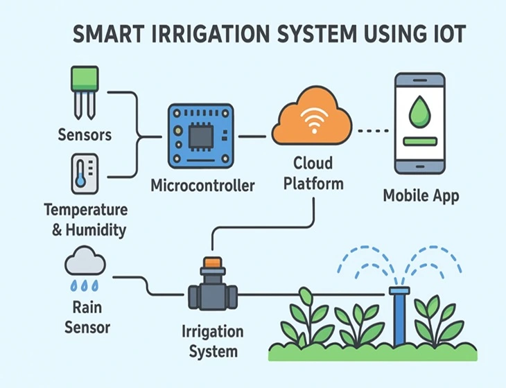
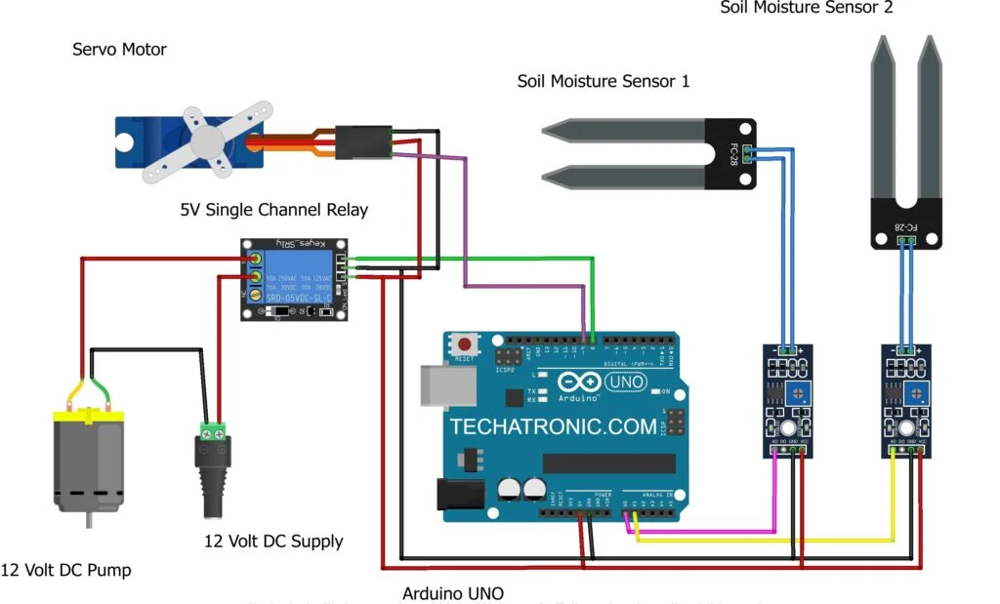
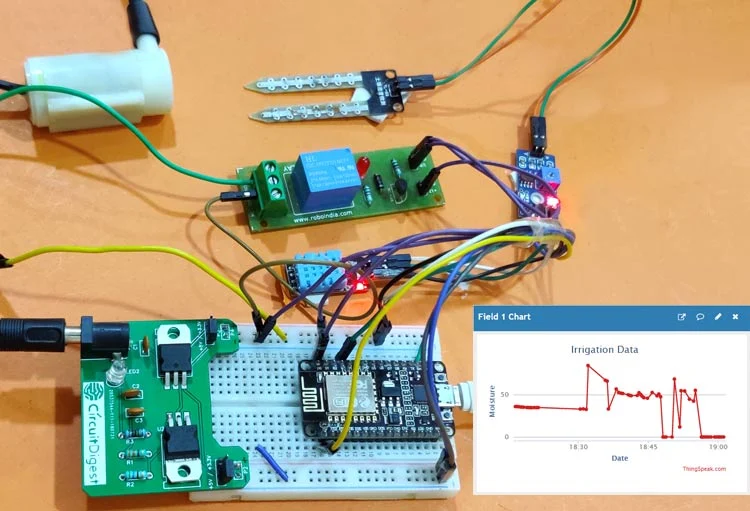

# 🌱 Smart Irrigation System Using IoT

## 📌 Project Overview

The Smart Irrigation System Using IoT is an intelligent agriculture solution designed to automate irrigation based on real-time soil moisture conditions. The system continuously monitors soil moisture levels using sensors and automatically controls a water pump whenever irrigation is required.

The project utilizes an ESP32 microcontroller, soil moisture sensor, DHT11 temperature and humidity sensor, relay module, and IoT cloud monitoring through Blynk. This helps reduce water wastage, improve crop health, and minimize human intervention in agricultural operations.

---

## 🎯 Problem Statement

Traditional irrigation systems rely heavily on manual monitoring and fixed watering schedules, which often result in:

* Excessive water consumption
* Over-irrigation and under-irrigation
* Increased labor requirements
* Poor resource utilization
* Lack of real-time monitoring

This project aims to solve these challenges through automation and IoT technology.

---

## 🎯 Objectives

* Monitor soil moisture continuously
* Automate irrigation based on soil conditions
* Reduce water wastage
* Enable remote monitoring through IoT
* Improve agricultural productivity
* Minimize human intervention
* Demonstrate practical IoT applications in smart farming

---

## 🚀 Features

* Automatic irrigation control
* Real-time soil moisture monitoring
* Temperature and humidity monitoring
* Cloud-based monitoring using Blynk
* ESP32 Wi-Fi connectivity
* Water conservation
* Remote access and monitoring
* Low-cost implementation
* Scalable design for larger farms

---

## 🛠 Hardware Components

| Component                           | Quantity    |
| ----------------------------------- | ----------- |
| ESP32 Development Board             | 1           |
| Capacitive Soil Moisture Sensor     | 1           |
| DHT11 Temperature & Humidity Sensor | 1           |
| Relay Module (1 Channel)            | 1           |
| Mini DC Water Pump                  | 1           |
| OLED Display                        | 1           |
| Rain Sensor Module                  | 1           |
| Breadboard                          | 1           |
| Jumper Wires                        | As Required |
| Power Supply                        | 1           |

---

## 💻 Software & Technologies Used

* ESP32
* Arduino IDE
* Embedded C++
* Blynk IoT Platform
* Wi-Fi Communication
* IoT Cloud Monitoring

### Libraries Used

* WiFi.h
* BlynkSimpleEsp32.h
* DHT.h
* Adafruit Unified Sensor Library

---

## 🏗 System Architecture



---

## 🔌 Circuit Diagram



---

## 📸 Hardware Setup



---

## ⚙️ Working Principle

### Step 1

The soil moisture sensor continuously measures the moisture level present in the soil.

### Step 2

The ESP32 reads the sensor values and processes the collected data.

### Step 3

The DHT11 sensor measures environmental temperature and humidity.

### Step 4

If the soil moisture level falls below a predefined threshold, the ESP32 activates the relay module.

### Step 5

The relay turns ON the water pump and irrigation starts automatically.

### Step 6

Once the desired moisture level is reached, the pump is switched OFF.

### Step 7

Sensor data is transmitted to the Blynk cloud platform through Wi-Fi for remote monitoring.

---

## 📊 Project Workflow

Soil Moisture Sensor ➜ ESP32 ➜ Relay Module ➜ Water Pump

DHT11 ➜ ESP32 ➜ Blynk Cloud ➜ Mobile Dashboard

---

## 📈 Expected Results

* Significant reduction in water consumption
* Improved crop health
* Automated irrigation management
* Remote monitoring capabilities
* Reduced manual effort
* Increased agricultural efficiency

---

## 🌍 Applications

* Agricultural Farms
* Smart Farming Systems
* Greenhouses
* Home Gardens
* Landscaping Projects
* Educational Demonstrations
* Research Projects

---

## 🔮 Future Enhancements

* Weather Forecast API Integration
* AI-Based Irrigation Prediction
* Solar Powered Operation
* Water Level Monitoring
* Multiple Irrigation Zones
* GPS-Based Farm Monitoring
* Cloud Data Analytics
* Smart Agriculture Dashboard

---

## 📂 Repository Structure

```text
Smart-Irrigation-System-Using-IoT/
│
├── Code/
├── Documentation/
├── Images/
├── Libraries/
└── README.md
```

---

## 👨‍💻 Author

**Rohit Arya**

Electronics & Communication Engineering (ECE)

Passionate about IoT, Embedded Systems, Automation, Smart Agriculture, Robotics, and Defense Technology.

---

## ⭐ If you found this project useful, consider giving it a star!
